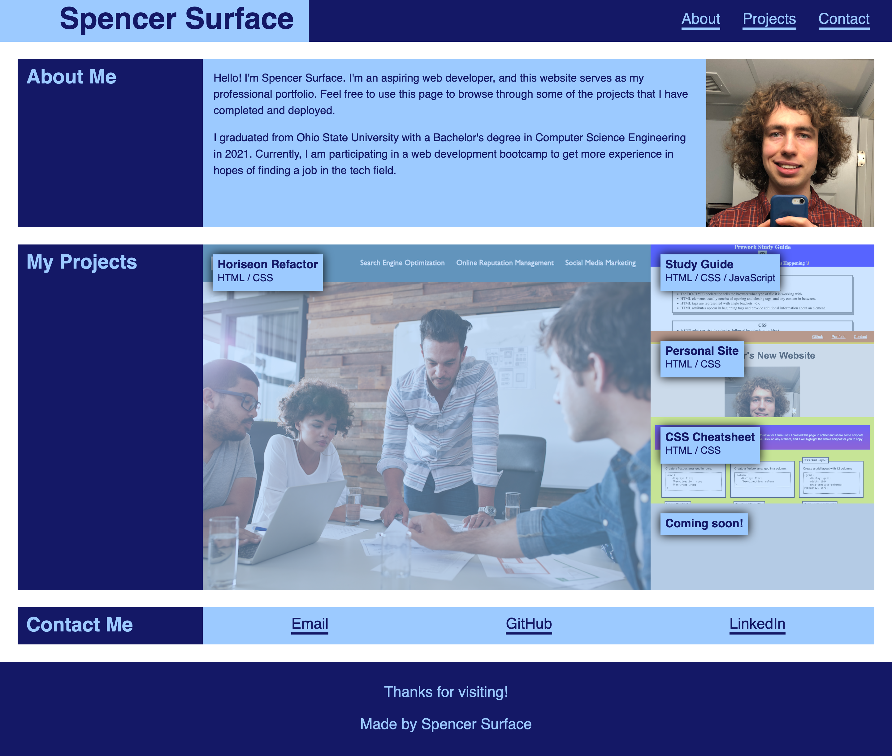

# Personal Portfolio

## Description

This project is a webpage that serves as a professional portfolio of my web development projects. The point of a portfolio site like this is to have a single convenient place from where I can demonstrate my programming skills to potential employers. The technologies used to make the site were HTML and CSS. Notably, CSS flexbox styling was extensively used to make the site responsive to varying screen sizes.

In completing this project, I learned that fleshing out the design of a webpage before creating it is crucial. Without first considering design, it is difficult to know where to start, and if you do start, it's easy to write sloppy, directionless code. Additionally, I learned that while CSS flexbox is powerful, it's not the best tool for every purpose - other tools, especially CSS grid, may be easier to use in other scenarios.

## Installation

N/A

## Usage

To view the page, navigate to https://spencersurface.github.io/personal-portfolio in your web browser.

Here is a screenshot demonstrating how the page should appear: 

## Credits

This project consists entirely of code and other assets created by myself. My design was guided by instructions, as well as a video of an example site, provided by edX Boot Camps LLC.

## License

No license at this time.